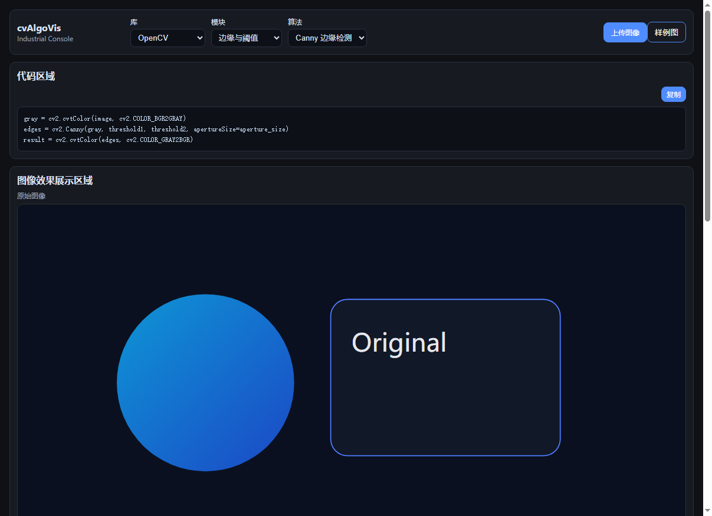

# cvAlgoVis

一个可交互的计算机视觉实验应用：前端实时调参，后端支持 `OpenCV` 图像处理与 `Open3D` 点云基础处理，并通过独立接口分别返回结果。

## 功能概览

- 主页为四方格工作台：
  - 左上：效果显示区（处理后图像）
  - 右上：参数设置区（含参数控制说明）
  - 左下：原始图像区
  - 右下：代码区（支持字号调节与高亮显示）
- 算法切换已扩充为九大类：
  - 颜色与强度处理（RGB/HSV/YUV/Lab、HDR）
  - 几何变换（仿射、透视、旋转、缩放、平移、倾斜）
  - 阈值与二值化（二值化、自适应、全局、Otsu）
  - 去噪与平滑（高斯、中值、均值、双边）
  - 形态学处理（开/闭/梯度/黑帽/白帽/顶帽/底帽）
  - 梯度与边缘检测（Canny、Laplacian）
  - 图像分割（分水岭、GrabCut）
  - 特征检测与描述（Harris、Shi-Tomasi、FAST、SIFT、SURF、ORB、LBP、HOG）
  - 匹配与检索（KNN、BF、FLANN、模板匹配、模板匹配+同源）
- 参数交互：滑块 + 数值输入 + 鼠标滚轮微调
- 实时反馈：前端节流调用 `/process`
- 多库独立：`OpenCV` 继续使用图像工作流，`Open3D` 使用点云文件工作流
- 开发辅助：算法 Python 代码片段 + OpenCV 函数说明
- 代码高亮：后端 Pygments 生成，主题为 Monokai
- 默认样例图：`frontend/public/samples/contact.png`
- Open3D 首版支持：`ply` / `pcd` 点云文件，当前返回处理摘要与统计信息

## 界面截图

### 真实 UI 工作台



### 输入示意（原始图像）


### 输出示意（处理后图像）


## 技术栈

- 前端：React + TypeScript + Vite
- 后端：FastAPI + OpenCV + Open3D + NumPy
- 测试：Pytest（单元 + 集成）

## 当前目录结构（与项目现状一致）

```text
cvAlgoVis/
  backend/
    app/
      main.py
      catalog.py
      schemas.py
      examples/
        code_snippets.py
      services/
        algorithms.py
        image_io.py
        opencv_reference.py
        pipeline.py
    tests/
      test_algorithms_unit.py
      test_api_process.py
    requirements.txt
  frontend/
    public/
      samples/contact.png
      screenshots/
        ui-workbench.png
        sample-before.svg
        sample-after.svg
    src/
      api/client.ts
      components/
        AlgorithmSelector.tsx
        CodePanel.tsx
        ImagePreviewPanel.tsx
        LibrarySelector.tsx
        ParamControlPanel.tsx
      config/libraryAlgorithmMap.ts
      hooks/
        useDebouncedEffect.ts
        useWheelAdjust.ts
      App.tsx
      main.tsx
      styles.css
      types.ts
    index.html
    package.json
    tsconfig.json
    vite.config.ts
  docs/
    api.md
  README.md
  .gitignore
```

## 环境要求

- Node.js 18+
- Python 3.10+
- pip

## 快速启动

### 1) 启动后端

```bash
cd backend
python -m venv .venv
```

Windows:

```bash
.venv\Scripts\activate
```

macOS/Linux:

```bash
source .venv/bin/activate
```

安装依赖并运行：

```bash
pip install -r requirements.txt
uvicorn app.main:app --host 0.0.0.0 --port 8000 --reload
```

Git Bash 推荐（避免 `uvicorn: command not found`）：

```bash
python -m uvicorn app.main:app --host 0.0.0.0 --port 8000 --reload
```

后端地址：`http://localhost:8000`

### 2) 启动前端

```bash
cd frontend
npm install
npm run dev
```

前端地址：`http://localhost:5173`

## 测试

在后端虚拟环境中执行：

```bash
cd backend
pytest -q
```

## 桌面软件打包

项目已提供基于 `Electron + Python sidecar` 的 **Windows 一键自动化打包**流程，默认输出可双击运行的便携版 EXE。

相关文件：

- `desktop/electron/`
- `backend/entry.py`
- `backend/pyinstaller.spec`
- `scripts/build-desktop-win.ps1`
- `scripts/smoke-test-desktop.ps1`
- `docs/desktop-packaging.md`

推荐命令：

```bash
npm run build:desktop
```

该命令会自动执行：

1. 清理旧构建产物
2. 构建前端静态资源
3. 打包后端 sidecar
4. 复用本地 Electron 发行版打出 Windows portable EXE
5. 执行桌面包自检

默认产物位置：

- `dist-desktop/cvAlgoVis 0.1.0.exe`
- `dist-desktop/win-unpacked/cvAlgoVis.exe`

说明：

- 当前默认自动化目标为 Windows
- 软件启动后会自动拉起静默后端，不弹黑框
- 前端会在桌面模式下自动读取运行时注入的 API 地址，不再写死开发地址
- `dist-desktop/`、`backend/dist/`、`backend/build/`、`.runtime/` 为构建或运行期产物，不需要手工提交

## OpenCV 函数清单（用途/参数/返回值）

以下函数已在 `backend/app/services/opencv_reference.py` 统一维护，并可通过 API 获取：

```text
GET /opencv-reference
```

| 函数 | 用途 | 核心参数 | 返回值 |
| --- | --- | --- | --- |
| `cv2.imread` | 从磁盘读取图像 | `filename`, `flags` | `ndarray` 或 `None` |
| `cv2.cvtColor` | 色彩空间转换（如 BGR->GRAY） | `src`, `code` | 转换后的 `ndarray` |
| `cv2.GaussianBlur` | 高斯滤波降噪 | `src`, `ksize`, `sigmaX` | 模糊后 `ndarray` |
| `cv2.Canny` | 边缘检测 | `image`, `threshold1`, `threshold2`, `apertureSize` | 单通道边缘图 `ndarray` |
| `cv2.findContours` | 轮廓查找 | `image`, `mode`, `method` | `(contours, hierarchy)` |
| `cv2.warpPerspective` | 透视变换 | `src`, `M`, `dsize` | 变换后 `ndarray` |
| `cv2.matchTemplate` | 模板匹配定位 | `image`, `templ`, `method` | 匹配响应图 `ndarray` |
| `cv2.CascadeClassifier.detectMultiScale` | 级联检测（如人脸） | `image`, `scaleFactor`, `minNeighbors`, `minSize` | 检测框数组 `(x,y,w,h)` |
| `cv2.adaptiveThreshold` | 自适应阈值二值化 | `src`, `maxValue`, `adaptiveMethod`, `thresholdType`, `blockSize`, `C` | 二值图 `ndarray` |
| `cv2.morphologyEx` | 形态学复合操作 | `src`, `op`, `kernel` | 处理后图像 `ndarray` |
| `cv2.grabCut` | 图割前景分割 | `img`, `mask`, `rect`, `iterCount`, `mode` | 更新后的 `mask` |
| `cv2.goodFeaturesToTrack` | Shi-Tomasi 角点检测 | `image`, `maxCorners`, `qualityLevel`, `minDistance` | 角点坐标数组 |
| `cv2.BFMatcher` / `cv2.FlannBasedMatcher` | 特征匹配器 | 匹配器配置参数 | 匹配器对象 |

## 常见问题

### `python -m venv .venv` 失败

- 现象：`python: command not found` 或命令直接退出
- 原因：系统未安装可用 Python 或 PATH 未配置
- 建议：先执行 `python --version`，确认解释器可用后再创建虚拟环境

### 代码区高亮不是彩色

- 现象：代码区显示纯文本，状态提示为“高亮已降级”
- 原因：`/code-snippet` 接口不可用（常见于后端未启动）
- 建议：先启动后端，再刷新前端页面；后端可用时状态会变为“高亮已启用（Pygments）”

## 联系方式


如果大家不想自己编译，可以
关注微信公众号后回复：cvAlgoVis 0.1.0，免费获取cvAlgoVis 0.1.0 软件（单一exe软件可直接打开）
